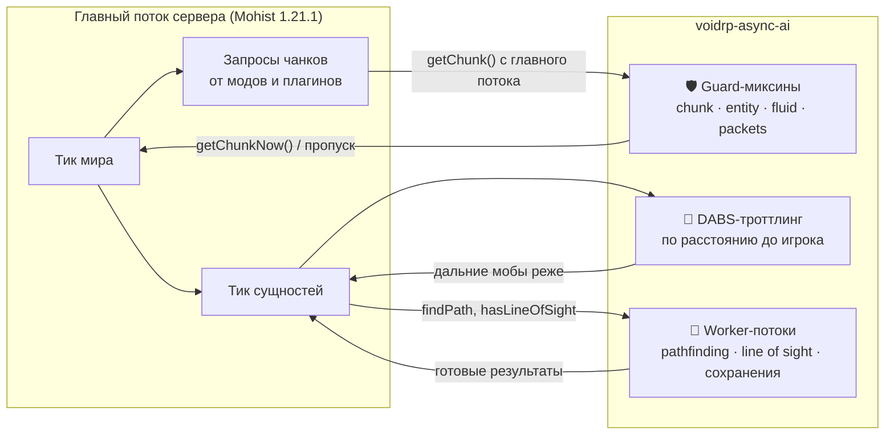
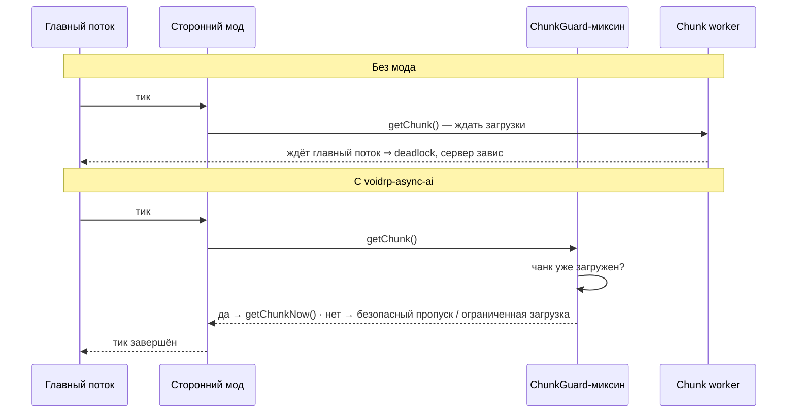
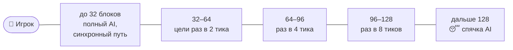

# ⚡ VoidRP Async AI

> Серверный NeoForge-мод производительности VoidRP: async pathfinding, троттлинг AI по расстоянию и 65 миксинов,
> которые не дают сторонним модам повесить главный поток или уронить сервер.


[](https://github.com/VOIDRP-MINECRAFT/voidrp-async-ai/actions/workflows/build.yml)


---

## ⚠️ Критическая важность

Без этого мода сервер **регулярно зависает** из-за chunk deadlock'ов, которые вызывают сторонние моды. Мод обязателен для стабильной работы VoidRP.

---

## 🗺️ Место в экосистеме



---

## ✨ Два типа функций

### 1. Производительность AI
- **Async Pathfinding** — `PathFinder.findPath()` выносится в worker-потоки для мобов дальше N блоков
- **Entity Hibernate** — полное отключение AI/тиков для сущностей вне зоны видимости игроков
- **Brain Throttle** — снижение частоты тиков Brain (память/поведение) для далёких мобов
- **Navigation Throttle** — реже пересчитывает пути для мобов вне активной зоны
- **Line-of-Sight Cache** — кэш результатов ray-cast видимости

### 2. Защита от chunk deadlock'ов (23 из 65 миксинов)

Паттерн: сторонний код вызывает `ServerChunkCache.getChunk()` из main thread → main thread блокируется ожидая chunk worker → deadlock.



**Покрытые паттерны:**

| Категория | Примеры миксинов |
|---|---|
| Базовые chunk guard | `BlockCollisionsChunkGuard`, `EntityBaseTickChunkGuard` |
| Моды: движение | `PlayerTravelChunkGuard`, `LivingEntityTravelGuard` |
| Моды: структуры | `StructureManagerChunkGuard`, `AetherPortalChunkGuard` |
| Плагины | `EssentialsRespawnChunkGuard`, `CitizensChunkUnloadGuard` |
| Сторонние моды | `IafPortalDataChunkGuard`, `LeafcutterAntForageChunkGuard` |
| Entity | `ItemEntityCollisionGuard`, `ServerPlayerGameModeMixin` |
| Fluid | `PostProcessFluidGuard`, `LevelFluidStateGuard` |
| Async сохранение | `PlayerDataSaveAsync`, `ChunkActivityMapAsyncSave` |
| Misc | `DragonFightSpamGuard`, `MekanismRadiationThrottle` |

---

## 📏 Троттлинг по расстоянию (DABS)



При просадке TPS адаптивный троттлинг сам увеличивает интервалы. Все пороги и переключатели — в
`config/voidrp_async_ai-server.toml`:

| Параметр | По умолчанию | Что делает |
|---|---|---|
| `asyncPathEnabled` | `true` | `PathFinder.findPath()` в worker-потоках для дальних мобов |
| `pathCacheEnabled` | `true` | Переиспользование недавних путей |
| `dabsEnabled` | `true` | Реже тикать goal/target selector у дальних мобов |
| `brainThrottleEnabled` · `navThrottleEnabled` | `true` | Реже сенсоры Brain и навигация |
| `hibernateEnabled` | `true` | Полностью пропускать `aiStep()` дальше `hibernateDist` |
| `spawnThrottleEnabled` | `true` | Реже спавн в далёких чанках |
| `adaptiveThrottleEnabled` | `true` | Усиливать троттлинг во время лагов |
| `parallelLosEnabled` | `true` | `hasLineOfSight()` параллельно на CPU/2 потоках |
| `chunkPreloadEnabled` | `true` | Предзагрузка чанков по направлению движения игрока |
| `chunkPreloadModdedDimensions` | `false` | То же в модовых измерениях |
| `asyncPathMinDist` · `throttleNearDist` · `throttleFarDist` · `throttleVFarDist` · `hibernateDist` | `32` · `32` · `64` · `96` · `128` | Пороги зон в блоках |

---

## 📋 Требования

| Компонент | Версия |
|---|---|
| Minecraft | 1.21.1 |
| NeoForge | 21.1.x |
| Java | 21 |

---

## 🚀 Сборка и деплой

```bash
cd voidrp_async_ai
./gradlew build
# → build/libs/voidrp_async_ai-1.0.0.jar

# Деплой на сервер
cp build/libs/voidrp_async_ai-1.0.0.jar \
   ../minecraft_server/mods/voidrp_async_ai-1.0.0.jar
# Перезапустить сервер
```

---

## 🏗️ Структура

Миксины лежат в `src/main/java/ru/voidrp/asyncai/mixin/` и перечислены в `mixins.voidrp_async_ai.json`:
23 `*ChunkGuard*`, 16 других guard-миксинов (сущности, жидкости, пакеты, null-цели GoalSelector),
4 троттлинга, 3 асинхронных сохранения, 2 дедупликации и ещё 17 точечных исправлений. Рядом —
`AsyncPathManager`, `ParallelLosManager`, `ChunkPreloadManager`, `AdaptiveThrottle`, `PlayerSaveWorker`.

---

## 🔗 Связанные репозитории

| Репо | Связь |
|---|---|
| [voidrp-cpm-companion](https://github.com/VOIDRP-MINECRAFT/voidrp-cpm-companion) | `CosmeticArmorSaveAsyncMixin` для CPM |
| [voidrp-anticheat](https://github.com/VOIDRP-MINECRAFT/voidrp-anticheat) | Работает параллельно на сервере |

---

<div align="center">
<a href="https://void-rp.ru">🌐 Сайт</a> ·
<a href="https://github.com/VOIDRP-MINECRAFT">🏠 Организация</a>
</div>
